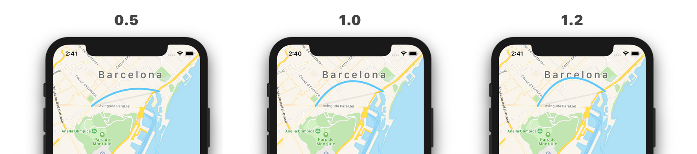

[](http://makeapullrequest.com)
[](http://cocoapods.org/pods/curvyRoute)


## 🗺 curvyRoute

An easy way to draw a curvy line between two points on a map.

## 🏆 Features

- [x] Display a curve on a map
- [x] Display a straight line on a map
- [x] Customise the radius multiplier

## 📝 Requirements

- iOS 8.0+
- Swift 4.2+

### 🛠 Installation

There are several methods to install curvyRoute:

- Via [CocoaPods](https://cocoapods.org)
- Download the ZIP for the [latest release](https://github.com/metrolab/curvyRoute/releases/latest)

#### CocoaPods

Add `curvyRoute` specs to your `Podfile`:

```ruby
pod 'curvyRoute'
```

### 👉🏼 Example

```swift
import MapKit
import UIKit
import curvyRoute

class ViewController: UIViewController, MKMapViewDelegate {
    @IBOutlet weak var mapView: MKMapView!

    override func viewDidAppear(_: Bool) {
        mapView.delegate = self
        addOverlays()
    }

    func mapView(_: MKMapView, rendererFor overlay: MKOverlay) -> MKOverlayRenderer {
        if let lineOverlay = overlay as? LineOverlay {
            return MapLineOverlayRenderer(lineOverlay)
        }
        return MKOverlayRenderer(overlay: overlay)
    }

    private func addOverlays() {
		let pointA = CLLocationCoordinate2DMake(41.375024, 2.149118) // Plaça d'Espanya, Barcelona
		let pointB = CLLocationCoordinate2DMake(41.380994, 2.185771) // Plaça Pau Vila, 1, Barcelona
        mapView.addOverlay(LineOverlay(origin: pointA, destination: pointB))
        let arc = ArcOverlay(origin: pointA, destination: pointB,
                             style: LineOverlayStyle(strokeColor: .systemTeal, lineWidth: 4, alpha: 1))
        arc.radiusMultiplier = 0.5
        mapView.addOverlay(arc)
    }
}
```

### 🤔 What is *radiusMultiplier* ?

This property will influence the shape of the arc. The default value is 1.



## 👨‍💻 Todo

- [x] Animate the polyline
- [x] ...

## 📖 License

curvyRoute is released under the MIT license. See `LICENSE` for details.
